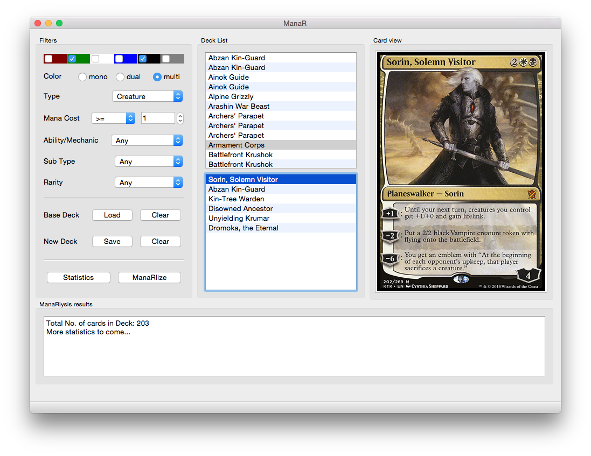

# ManaR

ManaR is yet another Magic: The Gathering (TM) deck building and management utility written in Python. This program runs offline and is platform independent. Organize your MTG cards, deck and strategy using an object oriented interface to mtg cards. It uses the JSON database files from [http://mtgjson.com/](http://mtgjson.com/). Classes can be used separately in other projects.

Copyright notice:
	
Magic: the Gathering, all card names and artworks are TM and copyright Wizards of the Coast, Inc, a subsidiary of Hasbro, Inc. All rights reserved. This program is unaffiliated. The program does not include such copyrighted material, they are downloaded on user demand from Internet.

#### Features

Following features are supported:

* QT5 based GUI + object oriented Python 3.4 code
* Automatic download of the missing JSON database files.
* Load a database of your cards
* Make and save individual decks from existing decks
* Save in [Cockatrice](https://github.com/Cockatrice/Cockatrice) format
* Search for cards and add them into the decks.
* Download card images from internet put in separate directories named after each deck
* Look up cards in using automatically generated URLs:
  * [http://mtgimage.com/](http://mtgimage.com/)
  * [http://gatherer.wizards.com/](http://gatherer.wizards.com/Pages/Default.aspx)
  * [http://magiccards.info/](http://magiccards.info/) 

#### Usage comments

JSON files and pictures are downloaded to user's home directory. Double clicking or pressing enter adds a card from the base deck into the new deck. Pressing delete or backspace removes a card from the new deck.

#### Similar projects

By searching the internet I found some other projects that based on their description may be similar to this code. I have not checked them myself, but I would like to list them here for the interested programmer just for information:

* [https://github.com/dblotsky/pymtg](https://github.com/dblotsky/pymtg)
* [https://code.google.com/p/pymtg/](https://code.google.com/p/pymtg/)
* [https://searchcode.com/codesearch/view/3958072/](https://searchcode.com/codesearch/view/3958072/)
* [https://github.com/mutanabbi/mtg](https://github.com/mutanabbi/mtg)

