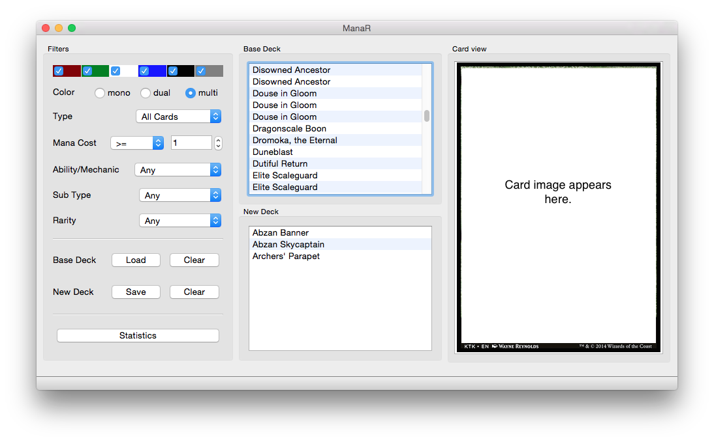

# ManaR

ManaR (previously called PyMTG) is yet another Magic: The Gathering (TM) utility written in Python. Organize your MTG cards, deck and strategy using an object oriented interface to mtg cards. It uses the JSON database files from [http://mtgjson.com/](http://mtgjson.com/). So please download the set files from there. Copyright notice: Magic: The Gathering (TM) and all card names and artworks are copyrighted material and belong to their owners.

#### Features

Following features are supported:

* Make a database of all your cards
* Make individual decks
* Search for cards and add them into the decks.
* Download card images from internet put in separate directories named after each deck
* Look up cards in using automatically generated URLs:
  * [http://mtgimage.com/](http://mtgimage.com/)
  * [http://gatherer.wizards.com/](http://gatherer.wizards.com/Pages/Default.aspx)
  * [http://magiccards.info/](http://magiccards.info/) 

#### Similar projects

By searching the internet I found some other projects that based on their description may be similar to this code. I have not checked them myself, but I would like to list them here for the interested programmer just for information:

* [https://github.com/dblotsky/pymtg](https://github.com/dblotsky/pymtg)
* [https://code.google.com/p/pymtg/](https://code.google.com/p/pymtg/)
* [https://searchcode.com/codesearch/view/3958072/](https://searchcode.com/codesearch/view/3958072/)
